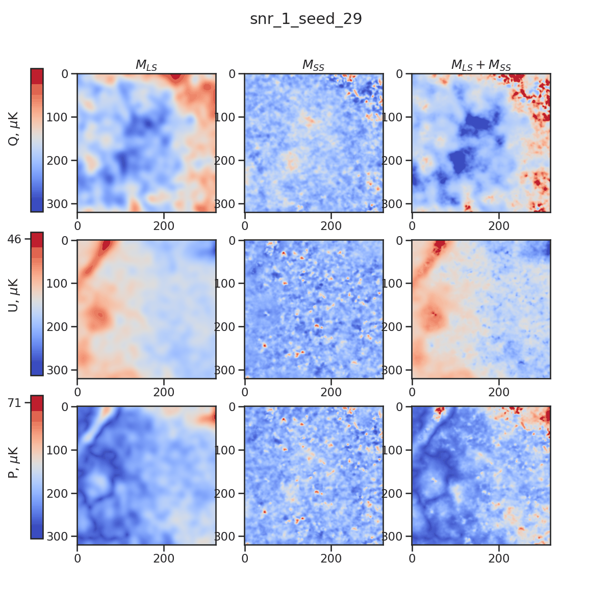

# ForSEplus

\*Different realizations of small scales at 12 arcminutes in the second column.

- Simulate **stochastic, polarized(QU), non-Gaussian** thermal dust emission at **353GHz** up to **3 arcminutes**.
- plus version of https://github.com/ai4cmb/ForSE.

- If you want to use the generated maps directly, we also offer some realizations of maps at url...

# Installations
## Dependencies  

- Namaster: to compute power spectra to normalize the small scales from neural networks
- reproject: only needed to perform projection from Healpix maps to flat patches and vice versa
- numba: only needed to accelearte the calculation of Minkowski functionals for a given patch

We assume you alrealy have your own python virtual environment. 
The first thing to do is to install the dependencies and the main difficulty is to install the `Namaster` package, which has its own dependencies. You can install it with `conda` and if you want to install `Namaster` dependencies from source codes, we prepared a [install_dependencies.sh](install_dependencies.sh) file for you. 

With all dependencies solved, you have two ways to install this package. 

## from source
Download the source code, then 

    (venv) $ python -m pip install . --user

## from pip (not updated with the latest source code yet)
    (venv) $ python -m pip install ForSEplus --user

# Ancillary data (Compulsory)
The zipped complete ancillary data can be downloaded [here](https://drive.google.com/file/d/1dqRQBc2832HpQHQx6dQzkwTkT71kSQiw/view?usp=sharing) (4GB, 9.4GB after decompression). Then decompress the files into a directory, whose path should be given to `dir_data` when running the pipeline. If you are on NERSC, you can use `dir_data = /pscratch/sd/j/jianyao/ForSE_plus_data_32/`, which I already open the permission to all users on NERSC. 

# Usage
Once installed, import the `forseplus` as:

    from ForSEplus.forseplus_class import forseplus
    
Then intialize a instance to generate maps:

    fp = forseplus(dir_data = '/pscratch/sd/j/jianyao/ForSE_plus_data_32/', 
            return_12 = True,
            go_3 = True,
            correct_EB = False, 
            seed = None)

You can choose to return sotchastic maps at 12 arcmin only (`return_12 = True, go_3 = False`), or maps at 3 arcmin only (`return_12 = False, go_3 = True`), or both (`return_12 = True, go_3 = True`), though in any case maps at 12 arcmin will be generated since 12arcmin maps will be the input to generate maps at 3arcmin. 

Then you can run:

    maps_12amin, maps_3amin = fp.run()
    
to obtain QU Maps, which will be in `uK_CMB` units. Returned QU maps at 12amin will be (2, 12\*2048\*\*2), 3amin will be (2, 12*4096\*\*2).

If set `correct_EB = True`, it will apply the E/B ratio correction proposed in Yao et al. to artificially tune the Cl_EE/Cl_BB = 2 for the generated small scales. Otherwise, Cl_EE/Cl_BB = 1. Refer to Section 4.1 of Yao et al. for more details. 

`seed` parameter defines the random seed to generate random component which are added to the fixed, observed large scales. If you want to generate many realizations, just put the `fp.run()` inside a loop and make sure `seed = None`.

## Memory needed (Peak memory) and time cost (with `correct_EB = False`, test on Perlmutter Jupyter login node)

|       Case       |  CPU  | GPU |   Time   |
| :--------------: | :---: | :-: | :------: |
|   only 12amin    |  16GB | 10GB | ~15 secs |
| also go to 3amin | 63.62GB* | 18GB | ~5 mins  |

\* This number is after a careful optimization which doesn't exceed the memory limit (64GB) on Perlmutter login node:-).  However if you have other notebooks running, there will be a 'kernel restarting' error caused by the memory limit, so you may open an Exclusive GPU node or submit the job to a compute node (which of course needs allocation hours, which is a bit troublesome(っ◞‸◟ c), but we will continue to optimize the memory usage during the running).

# Citation

    @ARTICLE{2021ApJ...911...42K,
           author = {{Krachmalnicoff}, Nicoletta and {Puglisi}, Giuseppe},
            title = "{ForSE: A GAN-based Algorithm for Extending CMB Foreground Models to Subdegree Angular Scales}",
          journal = {\apj},
         keywords = {Cosmic microwave background radiation, Neural networks, Diffuse radiation, 322, 1933, 383, Astrophysics - Cosmology and Nongalactic Astrophysics, Astrophysics - Instrumentation and Methods for Astrophysics},
             year = 2021,
            month = apr,
           volume = {911},
           number = {1},
              eid = {42},
            pages = {42},
              doi = {10.3847/1538-4357/abe71c},
    archivePrefix = {arXiv},
           eprint = {2011.02221},
     primaryClass = {astro-ph.CO},
           adsurl = {https://ui.adsabs.harvard.edu/abs/2021ApJ...911...42K},
          adsnote = {Provided by the SAO/NASA Astrophysics Data System}
    }
    
